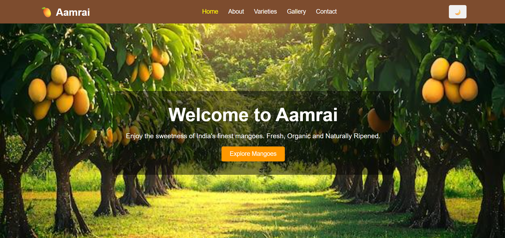
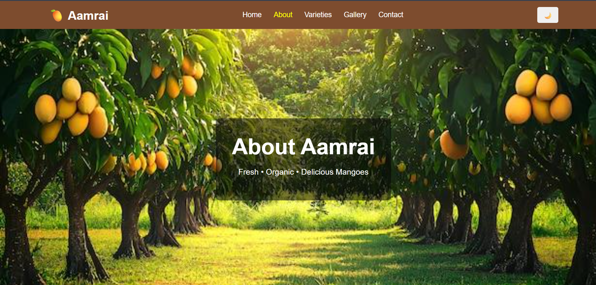
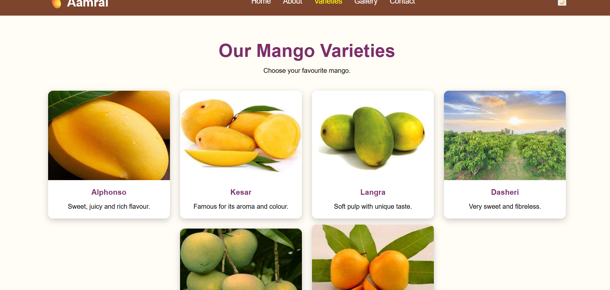
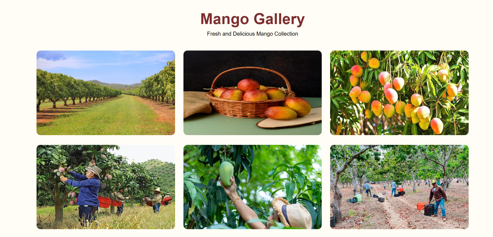
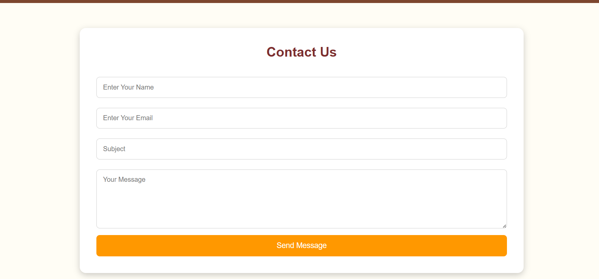

# 🥭 Aamrai Application

Aamrai Application is a simple and attractive website developed using HTML, CSS, and JavaScript. It showcases different varieties of mangoes, a beautiful image gallery, information about the farm, and a contact page. The project is responsive and user-friendly.

---

## 📌 Features

- 🏠 Home Page
- ℹ️ About Page
- 🥭 Mango Varieties
- 🖼️ Gallery
- 📞 Contact Form
- 🌙 Dark Mode
- 📱 Responsive Design
- 🎨 Attractive UI

---

## 🛠️ Technologies Used

- HTML5
- CSS3
- JavaScript

---

## 📂 Project Structure

```
Aamrai-Application/
│
├── index.html
├── about.html
├── varieties.html
├── gallery.html
├── contact.html
│
├── css/
│   ├── index.css
│   ├── about.css
│   ├── varieties.css
│   ├── gallery.css
│   └── contact.css
│
└── images/
    ├── banner.jpg
    ├── alphonso.jpg
    ├── kesar.jpg
    ├── langra.jpg
    ├── dasheri.jpg
    ├── banganapalli.jpg
    ├── totapuri.jpg
    ├── gallery1.jpg
    ├── gallery2.jpg
    ├── gallery3.jpg
    ├── gallery4.jpg
    ├── gallery5.jpg
    └── gallery6.jpg
```

---

## 🚀 How to Run

1. Download or Clone the repository.
2. Open the project in Visual Studio Code.
3. Open `index.html` in your browser.
4. Explore all pages using the navigation menu.

---

## 📷 Project Screenshots

### Home Page


### About Page


### Varieties Page


### Gallery Page


### Contact Page


---

## 👩‍💻 Developed By

**Sakshi Nagade**

---

## ⭐ Thank You

Thank you for visiting the Aamrai Application.